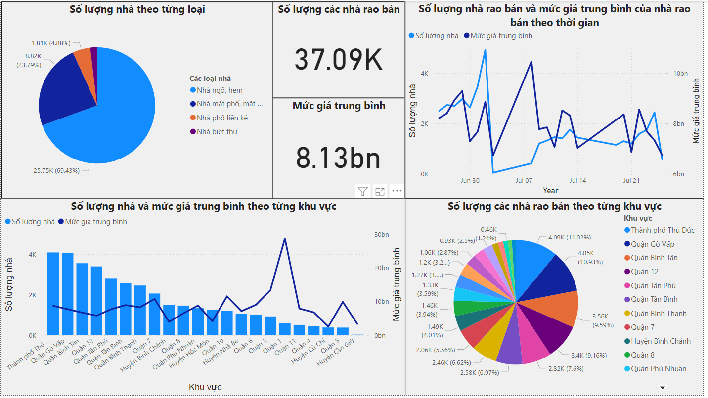
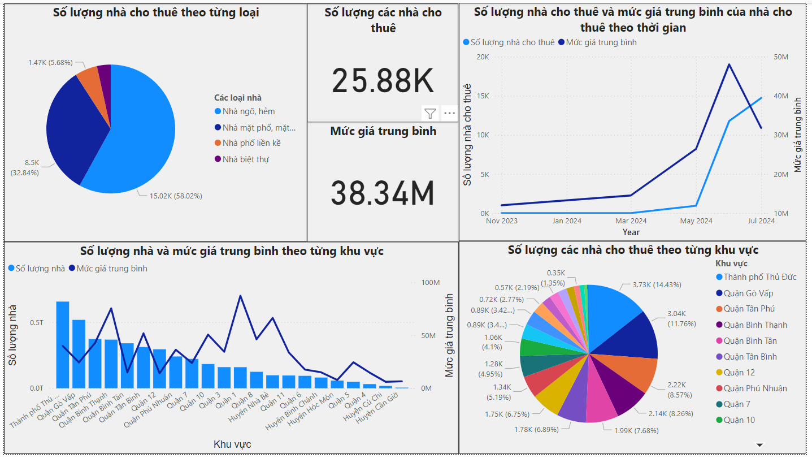
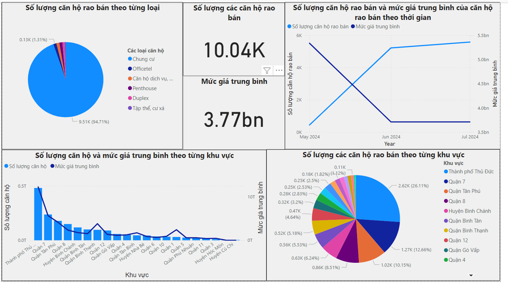
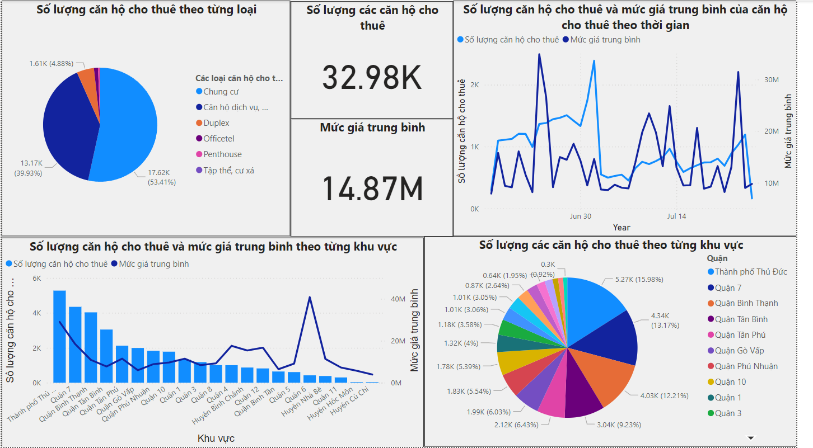
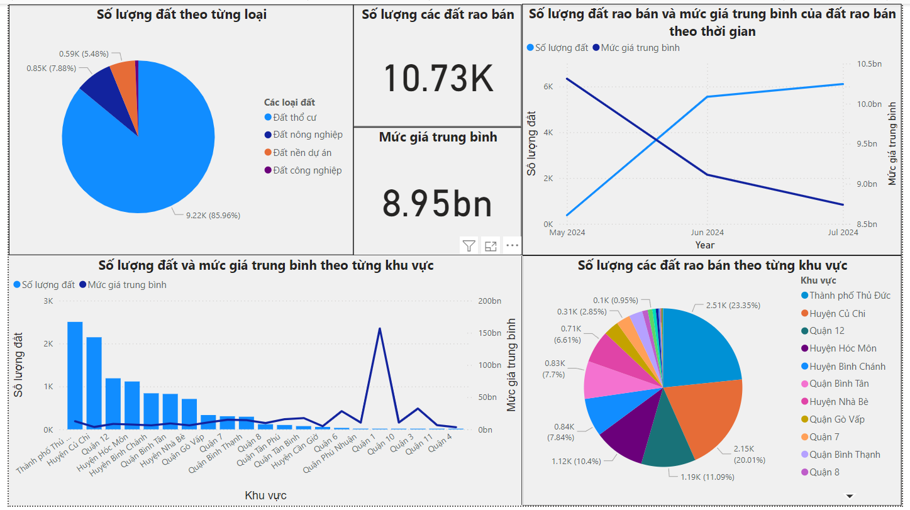
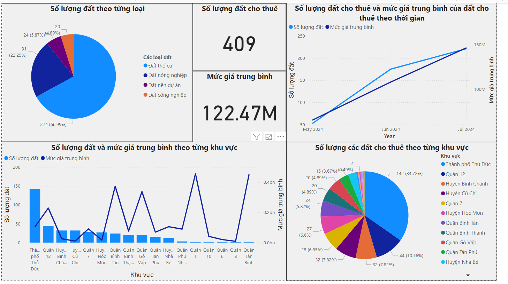
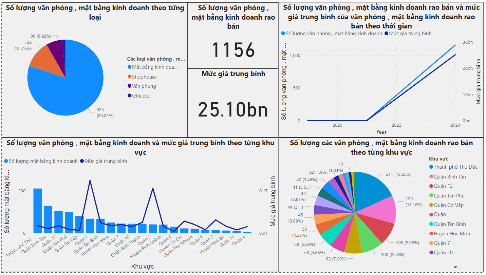
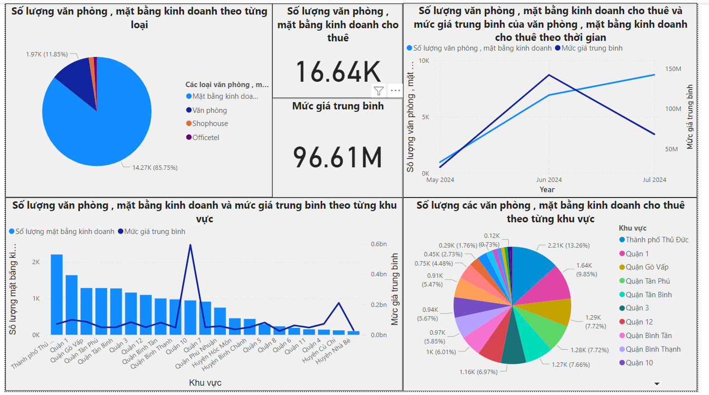

# 1. Pipeline
This directory includes 4 ETL pipelines processing 4 categories of real estate data : Land , Office , Apartment , House . Each pipeline will extract the latest data from MongoDB then perform some steps of transforming raw data and finally write to SQL server for further usage.

Steps of tramsforming raw data : 
1. Fill missing columns for raw data (Some data don't have enough features in given schema)
2. Convert Large number into Float 
3. Create Spark DataFrame
4. Drop rows which miss some important data such as information data
5. Join information data from the database to prevent the missing value in DataFrame
6. Fill null values based types of data
7. Update wrong list_time data and create new column `date` based on `list_time` column 

# 2. Dashboard 
The dashboard built on PowerBI to show some insights about the real estate market for each category

1. House category
- Sell advertisements

- Rent advertisements

2. Apartment category
- Sell advertisements

- Rent advertisements

3. Land category
- Sell advertisements

- Rent advertisements

4. Office category
- Sell advertisements

- Rent advertisements
